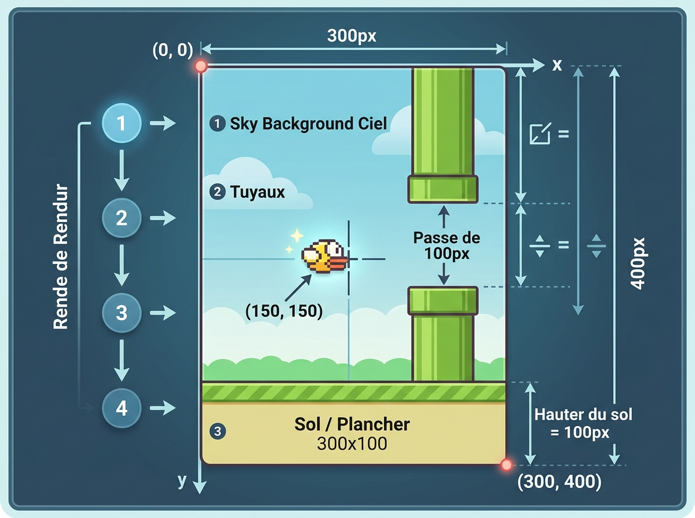

# 🐤 Flappy Bird - JavaScript & HTML5 Canvas

Un jeu Flappy Bird réalisé en JavaScript natif avec HTML5 Canvas.

---

## 🎨 Fonctionnement du Canvas & Ordre des Calques



### 🎯 1. Le Repère de Coordonnées (Canvas 2D)
* **`(0, 0)`** : Situé tout en **haut à gauche**.
* **Axe X (→)** : Augmente de 0 à **300 px** vers la droite.
* **Axe Y (↓)** : Augmente de 0 à **400 px** vers le bas.
* **`(300, 400)`** : Le coin tout en **bas à droite**.

---

### 🥞 2. L'Ordre des Calques (Algorithme du Peintre)

Chaque appel de `drawImage` dans `dessine()` vient peindre par-dessus le calque précédent :

1. **Calque 1 (Fond)** : `imageArrirePlan` en `(0, 0)` couvre la totalité du canvas.
2. **Calque 2 (Obstacles)** : `imageTuyauBas` et `imageTuyauHaut` sont dessinés aux coordonnées X et Y calculées.
3. **Calque 3 (Sol / Avant-Plan)** : `imageAvantPlan` en `(0, cvs.height - 100)` vient se poser tout en bas et **recouvre la base du tuyau**.
4. **Calque 4 (Oiseau)** : `imageOiseau1` en `(150, 150)` au premier plan pour qu'il soit toujours bien visible.
5. **Calque 5 (Bordure)** : `strokeRect` trace le cadre de 3px tout autour.

---

### 📐 3. Calcul de la position du Tuyau du Haut

```javascript
yTuyauHaut = yTuyauBas - ecartTuyau - imageTuyauHaut.height;
```
* **`yTuyauBas`** = 250 px (début du tuyau du bas)
* **`- ecartTuyau`** = -80 px (passage libre pour l'oiseau)
* **`- 240 px`** = hauteur du sprite du tuyau pour que son extrémité inférieure arrive pile au bon endroit.
* -> **$Y = 250 - 80 - 240 = -70\text{ px}$** (le haut de l'image est masqué au-dessus de l'écran).

